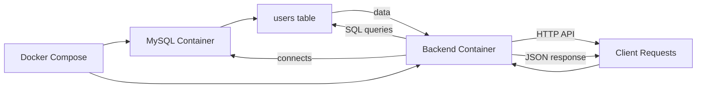
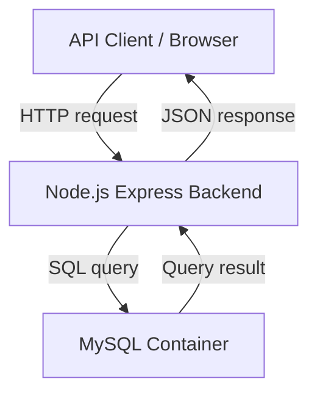

# 🚀 Multi-Container App

A backend-only Node.js Express service demonstrating Dockerized MySQL integration with user CRUD APIs and startup health handling.


---

# 📘 Project Overview

- What the project does
  This project exposes REST APIs to create, read, update, and delete user records in a MySQL database. It also includes a simple metrics endpoint.

- Why it was built
  It was built to demonstrate a multi-container Docker setup where the backend waits for the database to be ready, and to show how Node.js can interact with MySQL inside Docker.

- Who uses it
  API consumers, developers, or interview reviewers looking for a containerized backend project using Node.js and MySQL.

- Problem it solves
  It solves the problem of reliable service startup in Docker compose by waiting for the database healthcheck before starting the backend, and provides a simple CRUD API service for user data.

---

# ⭐ Key Features

## User Features

- 🧑‍💻 Add a new user record
- 📄 List all users
- 🔍 Retrieve a single user by ID
- ✏️ Update a user name
- 🗑️ Delete a user

## Admin Features

- 🛠️ No dedicated admin UI exists in this repository
- ⚙️ System-level admin capability is handled via Docker Compose service orchestration

## System Features

- 🐳 Dockerized Node.js backend
- 🧩 Docker Compose multi-container setup
- 🗃️ MySQL container with initialization script
- 🔄 Backend retry logic until MySQL is ready
- 📈 `/metrics` endpoint for service monitoring

---

# 🔄 Application Workflow

1. Docker Compose starts two services: `db` (MySQL) and `backend` (Node.js app).
2. MySQL initializes and runs `init.sql` to create the `users` table.
3. The backend container builds from `Dockerfile` and starts `app.js`.
4. `app.js` uses a MySQL connection pool and retries until the database becomes available.
5. Once connected, the backend listens on port `3000`.
6. API clients send HTTP requests to create, read, update, or delete users.
7. The backend executes SQL queries against the `users` table and returns JSON responses.



---

# 🧰 Technology Stack

| Technology        | Purpose                                      |
| ----------------- | -------------------------------------------- |
| Node.js           | Runtime for backend JavaScript               |
| Express           | Web framework for routing API requests       |
| MySQL             | Relational database for storing user data    |
| mysql2            | Node.js driver for MySQL connectivity        |
| Docker            | Container runtime for isolating services     |
| Docker Compose    | Orchestrates backend and database containers |
| `mysqladmin ping` | Health check command for database readiness  |

---

# 🏗️ System Architecture

The project is backend-focused and uses Docker to wire together the application and database.



---

# 📁 Folder Structure

multi-container-app/
├── `app.js` – Express backend and API routes
├── `Dockerfile` – Builds the Node.js backend container
├── `docker-compose.yml` – Defines `backend` and `db` services
├── `init.sql` – Creates the `users` table on MySQL startup
├── `package.json` – Node package configuration
├── `package-lock.json` – Locked dependency versions
└── `node_modules/` – Installed Node dependencies

---

# 🗄️ Database Design

- Tables
  - `users`

- Important fields
  - `id` — primary key, auto-increment integer
  - `name` — user name string up to 100 characters

- Relationships
  - None — this schema is a single-table design

- Data flow
  - API writes new rows into `users`
  - API reads rows from `users`
  - API updates and deletes rows by `id`

---

# 🧾 API Overview

| Method | Endpoint      | Purpose                              |
| ------ | ------------- | ------------------------------------ |
| POST   | `/add`        | Add a new user                       |
| GET    | `/users`      | List all users                       |
| GET    | `/users/:id`  | Get a single user by ID              |
| PUT    | `/update/:id` | Update a user's name                 |
| DELETE | `/delete/:id` | Delete a user                        |
| GET    | `/metrics`    | Return simple service health metrics |

---

# 🔐 Authentication & Authorization

- Login flow
  Not implemented in this repository.

- Token/session handling
  Not implemented.

- Protected routes
  None — all API routes are open.

- Role-based access
  Not implemented.

> This project is a backend service with public CRUD APIs and does not include authentication or authorization logic.

---

# 🖼️ Project Screenshots

## 📬 Postman API Testing

Tested REST API endpoints using Postman to verify application functionality, request handling, and response validation.


---

## 🐳 Docker Containerization

Application containerized using Docker for consistent deployment across different environments.


---

## 🔄 Jenkins CI/CD Pipeline

Automated build and deployment process configured using Jenkins for continuous integration and delivery.


---

## 📊 Prometheus Monitoring

Prometheus used for collecting and monitoring application metrics and system performance.


---

### 🚀 DevOps Tools Used

- 🐳 Docker
- 🔄 Jenkins
- 📬 Postman
- 📊 Prometheus

---

# ▶️ How to Run the Project

## Prerequisites

- Docker Desktop
- Docker Compose
- Git (optional)

## Clone Repository

```bash
git clone <repo-url>
cd multi-container-app
```

## Install Dependencies

Dependencies are installed inside the Docker build process. If running locally instead:

```bash
npm install
```

## Configure Environment Variables

No external environment file is required. Credentials are defined in:

- `docker-compose.yml`
- `app.js`

## Start Backend

```bash
docker-compose up --build
```

## Access Application

- Backend API: `http://localhost:3000`
- MySQL optional port: `localhost:3307`

---

# Project Execution Flow

- Docker Compose starts the MySQL container and the backend container.
- MySQL runs `init.sql` to create the `users` table.
- The backend waits for MySQL readiness using a retry loop.
- After successful connection, the backend listens on port `3000`.
- Client requests hit Express routes, and the app uses `mysql2` to query MySQL.
- Responses are returned as JSON to the client.

---

# Challenges Solved

- Reliable startup order between backend and database using health checks
- CRUD operations with Express and MySQL
- Docker Compose orchestration for multi-container development
- MySQL initialization via mounted SQL script
- Basic monitoring-friendly `/metrics` endpoint

---

# 💡 Key Learnings

- Building a Dockerized Node.js backend service
- Using Express for REST API routing
- Connecting Node.js to MySQL with `mysql2`
- Managing MySQL container lifecycle and readiness
- Implementing CRUD operations with SQL queries

---

# 🚀 🚀 Future Enhancements

- Add a frontend UI for user management
- Implement authentication and authorization
- Move database credentials to environment variables
- Add input validation and error handling
- Add automated tests for APIs
- Add pagination and search for user listing
- Add logging and structured monitoring

---

# 📝 Quick Revision Notes

Read This Before Interview

- Project Goal
  A Dockerized Node.js Express backend that manages user records in MySQL and demonstrates a reliable multi-container startup workflow.

- Technologies Used
  Node.js, Express, MySQL, Docker, Docker Compose, `mysql2`.

- Architecture
  Backend container communicates with a MySQL container. Docker Compose ensures service dependency ordering.

- Database
  Single `users` table with `id` and `name`. MySQL is initialized by `init.sql` on startup.

- Authentication
  Not implemented in this project.

- APIs
  `POST /add`, `GET /users`, `GET /users/:id`, `PUT /update/:id`, `DELETE /delete/:id`, `GET /metrics`.

- Main Features
  CRUD API, Docker Compose orchestration, DB connection retry, MySQL init script.

- Key Learnings
  Docker container orchestration, Express REST APIs, MySQL integration, service readiness handling.
